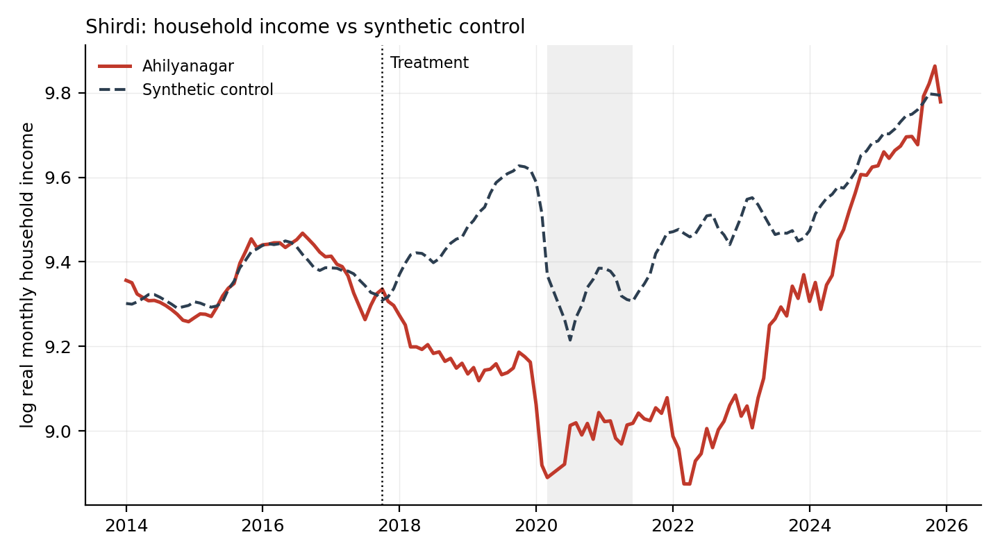

# Pilgrimage Transport Infrastructure and Household Income

Synthetic control evidence from India's Consumer Pyramids Household Survey,
2014-2025.

Does public investment in transport built to move pilgrims raise income in the
district it serves? Three cases estimated: an airport serving Shirdi, a new
terminal at Prayagraj, and the Kartarpur corridor to the Sikh shrine at Dera
Baba Nanak.

Includes a synthetic control implementation written from scratch, a CPI
deflator pipeline, a treatment feasibility screener, and a set of diagnostics
that withdrew two of the three cases.

---

## Finding

No evidence that improved access to a religious site raised local household
income.

Two of the three estimates fail their own placebo test and are withdrawn. The
third, Shirdi, shows income **21% to 35% below synthetic control on average**,
concentrated at the top of the distribution. It is reported as an association,
not a causal effect, for three reasons: the counterfactual rests on five donors
with one carrying half the weight, a state-level agrarian shock cannot be
excluded, and the gap is not permanent.



The solid line is the treated district, the dashed line its synthetic control,
the dotted vertical the month scheduled flights began, and the shaded band the
COVID telephone-interview window. The two lines track each other for the
three and a half years before treatment, separate through 2018, stay apart for
six years, and meet again at the right-hand edge.

That last part matters. The gap by year runs -20%, -35%, -31%, -29%, -39%,
-25%, -12%, -3% from 2018 to 2025, and over the final six months it is -0.7%,
which is zero for any practical purpose. A new airport is a permanent change to
a district, so an effect caused by one should persist. A gap that opens, deepens
through the drought years and COVID, then closes as those pass looks much more
like a transitory regional shock. The headline number is the average of that
profile, not a standing level.

Full write-up: [`docs/transport-results.md`](docs/transport-results.md)

---

## Why the diagnostics matter more than the estimate

Three cases were attempted. Two were withdrawn, and neither withdrawal was
decided by a p-value.

**Prayagraj reports -18.7%, and so does its placebo.** Moving the treatment date
into a window where nothing happened returns -0.2123 against a headline of
-0.2067. The town was already drifting below its synthetic control before the
terminal opened.

**Kartarpur was never validly specified.** Its treated unit is rural; the donor
pool is urban by construction. A rural district was matched against 85 urban
ones, which explains a pre-treatment RMSPE of 0.1252 against about 0.03 for the
two urban cases.

And two robustness checks in this repository were found to have never executed
at all. `leave_one_out` was passed a duplicate keyword argument and returned an
empty dict inside a bare `except`. The structurally matched donor pool
referenced `t_break` 230 lines before it was assigned and raised
`UnboundLocalError` on every case ever run. Both printed nothing. Both are
fixed, and when the matched-pool check finally ran it disagreed with the Shirdi
headline by 52%.

A robustness check that cannot fail loudly is not a robustness check.

---

## Reproducing

### What this repository does and does not contain

**Contains:** all code, the write-up, the headline estimates
(`output/results/summary.csv`) and the results figures.

`summary.csv` has five rows, and three of them are Shirdi. **That is one result
and two diagnostics, not three findings.** `Shirdi` is the headline.
`ShirdiOpenPool` and `ShirdiMHOnly` are confound tests: the same unit, date and
estimator, differing only in which donors are eligible, run to check whether a
state-level shock rather than the airport explains the estimate. `ShirdiMHOnly`
reports -0.125 from a single-donor counterfactual with a pre-treatment fit 5.26x
the noise floor and a wrong-signed placebo, and it is included as evidence that
the test could not be run, not as an estimate. `Prayagraj` and `Kartarpur` are
both withdrawn.

**Does not contain:** any dataset derived from CPHS microdata. Not the panel,
not the per-district screening tables, not the outcome series, not the donor
weights. CMIE Consumer Pyramids data is licensed, and while published
*estimates* from licensed data are standard practice, bulk derived tables are
not. `.gitignore` enforces this with an explicit whitelist, and
`check_before_push.py` refuses to let anything else through. Everything withheld
is regenerated by the code in under an hour.

The MoSPI CPI file is public domain but is also not shipped, because
`fetch_cpi.py` rebuilds it in about five minutes.

### Data you must obtain yourself

**CMIE Consumer Pyramids (CPHS) household income waves**. 144 monthly files,
January 2014 to December 2025, roughly 8.6 GB. Licensed; access requires a CMIE
subscription, usually through an institution. Expected layout:

```
CMIE_Income_raw/
  2014/household_income_20140131_MS_rev.csv
  ...
  2025/household_income_20251231_MS_rev.csv
```

Point `RAW_DIR` in `config.py` at that folder, or set `CMIE_RAW_DIR`.

**MoSPI Consumer Price Index**. Fetched automatically by `fetch_cpi.py`, no
credentials needed.

### Run

```bash
python -m venv .venv && source .venv/bin/activate   # Windows: .venv\Scripts\activate
pip install -r requirements.txt

python test_deflate.py                  # 8 deflator regression tests, ~2s
python fetch_cpi.py --source mospi      # state x sector x month CPI
python run_01_build_panel.py            # ~9 min over 144 waves
python screen_treatments2.py treatments_transport.csv   # which sites are estimable
python run_02_scm.py --all              # estimate every case in config.TREATMENTS
```

`run_02_scm.py --jobs N` sets worker count; `--jobs 1` for readable tracebacks.
On Windows, run from a terminal rather than a notebook, since the placebo loop
spawns processes and re-imports the module.

`run_01_build_panel.py` refuses to run without a CPI deflator unless you pass
`--allow-nominal`. Cumulative inflation over the panel is 72%, and a nominal
headline should not be producible by forgetting a setting.

---

## The panel

| | |
|---|---|
| Waves | 144 monthly CPHS files, Jan 2014 to Dec 2025 |
| Raw household records | 24,230,597 |
| Usable after non-response and positive-income filters | 17,966,470 |
| Sampling units the panel is built from | at least 4,725 CPHS PSUs, across 102 homogeneous regions |
| Analysis panel | 842 district-sector units (292 urban), 97,697 unit-months, 142 months |
| Deflator | MoSPI CPI, General index, state x sector x month, base 2012=100 |

The panel is built from at least 4,725 CPHS primary sampling units across 842
district-sector cells and 142 monthly waves. 842 district-sector units clear the
screening thresholds and enter estimation; `count_units.py` reproduces every
figure in that sentence.

Two months, April and May 2020, are dropped for every unit: MoSPI published no
CPI during the lockdown, and interpolating across it would invent exactly the
state-specific variation the deflator exists to measure.

### District renames

CPHS relabelled a batch of districts in the August 2025 wave. Each rename splits
a district into two fragments, an old label ending in July 2025 and a new one
with five months, and both then fail the coverage screen and vanish from the
donor pool silently.

Ahmednagar to Ahilyanagar is one of these, and it is the district containing
Shirdi's airport. Without the alias the case is not estimable and the screener
reports it as a coverage failure rather than a naming problem. `find_renames.py`
detects these by fingerprint: contiguous fragments, adjacent in time, tiling the
panel, with matching income and household counts, and one-to-one. Every
suggestion still requires human confirmation against India's actual rename
history.

---

## What's in here

| | |
|---|---|
| `config.py` | every path, date and tuning knob; the treatment definitions |
| `panel.py` | 144 waves to district-month panel; deflator; donor screens; break detection; district aliases |
| `scm.py` | synthetic control from scratch: simplex, de-meaned, ridge-augmented |
| `run_01_build_panel.py` | stage 1: build and diagnose the panel |
| `run_02_scm.py` | stage 2: estimate, robustness, decompositions |
| `fetch_cpi.py` | MoSPI CPI, with a CMIE Economic Outlook reshaper as fallback |
| `screen_treatments.py` | treatment feasibility screener (urban only) |
| `screen_treatments2.py` | screener considering both sectors, with a movable analysis start |
| `diagnose_sites.py` | why a site failed: name, sector, or which months are missing |
| `find_renames.py` | detect districts CPHS renamed mid-panel |
| `count_units.py` | what the panel covers, at four sampling levels |
| `test_deflate.py` | 8 regression tests for the deflator |
| `check_before_push.py` | refuses to let licensed data reach the repo |
| `treatments_transport.csv` | 12 screened sites, dates from primary sources |
| `docs/transport-results.md` | full write-up |
| `output/results/summary.csv` | headline estimates, five rows |
| `output/figures/` | 20 figures: paths, placebos, distribution, composition |

### Method notes

- **Estimators:** simplex-constrained SCM (Abadie, Diamond & Hainmueller 2010),
  de-meaned (Doudchenko & Imbens), ridge-augmented (Ben-Michael, Feller &
  Rothstein 2021). All three are reported for every case.
- **Penalty selection** is by rolling-origin cross-validation on pre-treatment
  months only, then held fixed across the treated unit and every placebo, so no
  post-treatment outcome can influence it.
- **Inference** is permutation over placebo units, with two p-values reported.
- **The noise floor is measured empirically**, not from the reported sampling
  standard error. CPHS draws each district-month from a single primary sampling
  unit, so `std/sqrt(n)` understates true volatility by a factor of 1.2 to 6.3
  depending on the unit. Every fit is reported as a multiple of that floor, and
  a fit tighter than the floor is flagged rather than celebrated.
- **Parallelism** pins BLAS to one thread per worker. Without the pin the pool
  runs slower than serial; with it, serial and parallel results are
  bit-identical. Thread count changes floating-point summation order, which
  without the pin moved one placebo across the RMSPE-ratio threshold and shifted
  a p-value from 0.128 to 0.122. In practice the Shirdi case has been estimated
  in three separate invocations, single-case and `--all`, and returned ATT
  -0.2784, pre-RMSPE 0.0297 and p = 0.138 every time to four decimal places.

---

## Limitations

Stated in full in the write-up. The four that matter most:

1. **One primary sampling unit per district.** `n_psu = 1` for every treated
   unit. A shock to that one neighbourhood cannot be separated from a
   district-wide effect.
2. **Thin counterfactuals.** Shirdi's rests on five donors with one at 52%, and
   the district is not spanned by any combination of units in its own state.
3. **The effect is not persistent.** The gap closes by 2025, which is hard to
   reconcile with a permanent change to the district.
4. **Treatment intensity is never measured.** AAI publishes monthly passenger
   traffic by airport and it is not yet joined in. Until it is, this study
   cannot say whether the visitors actually arrived.

CPHS sampling is itself contested. See Drèze & Somanchi (2021) and Pais & Rawal
(2021), both cited in the write-up.

---

## Licence

Code is released under the MIT Licence (see `LICENSE`).

**This does not extend to the data.** CPHS microdata is licensed by CMIE and is
neither included nor redistributable. MoSPI CPI is public domain.

---

## Citation

If you use this code, please cite the repository and the methods papers listed
in the write-up.
